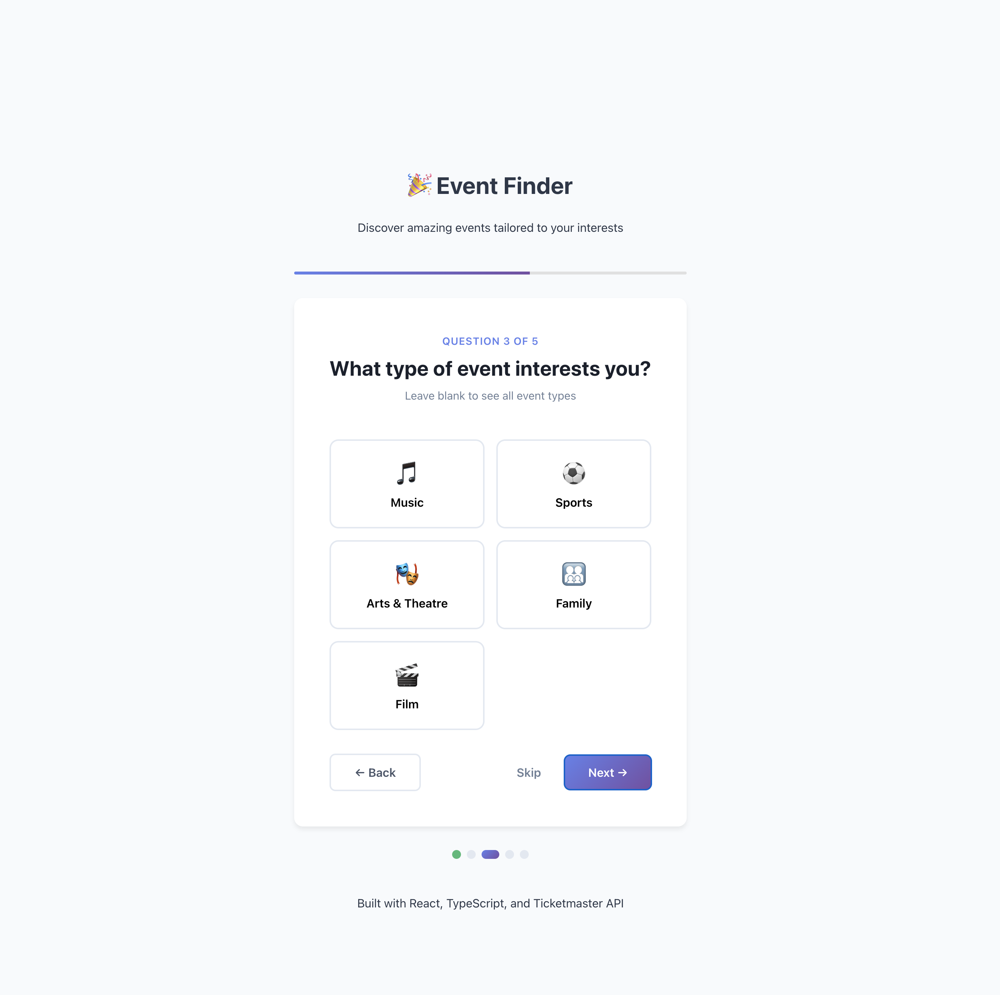
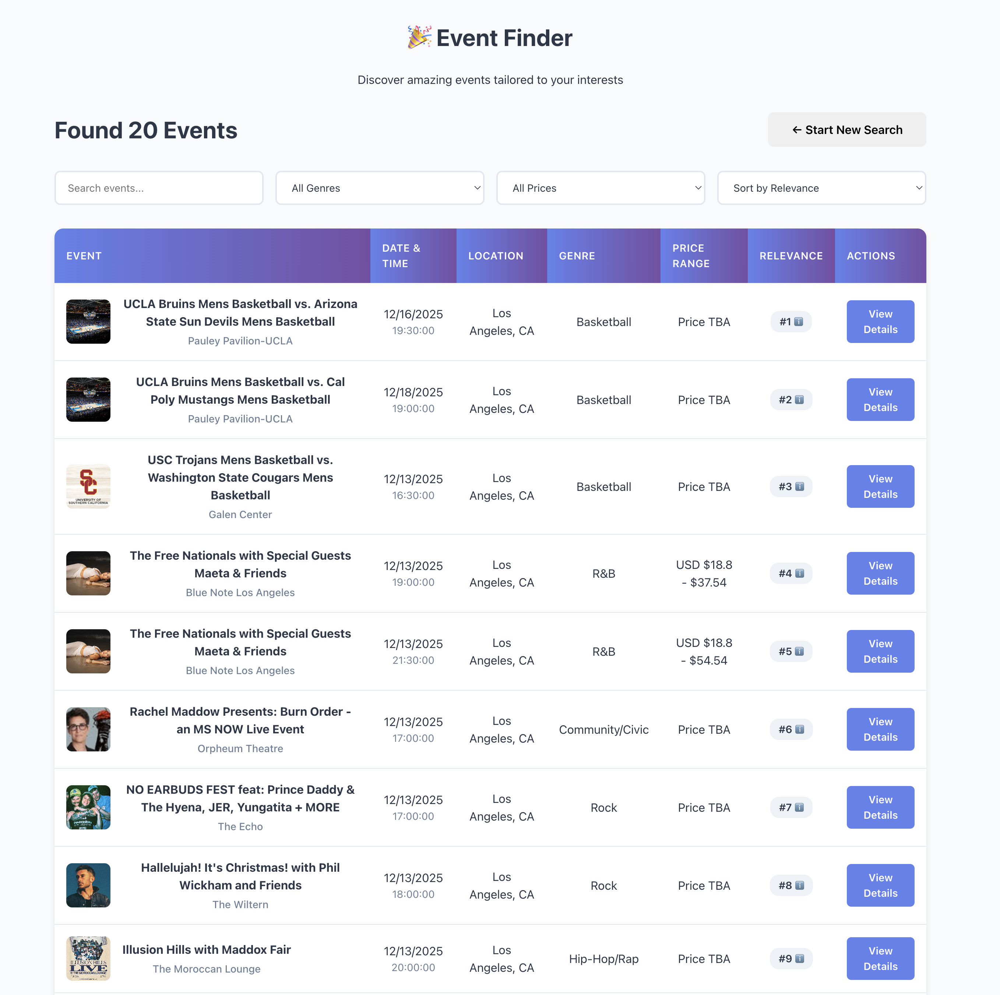
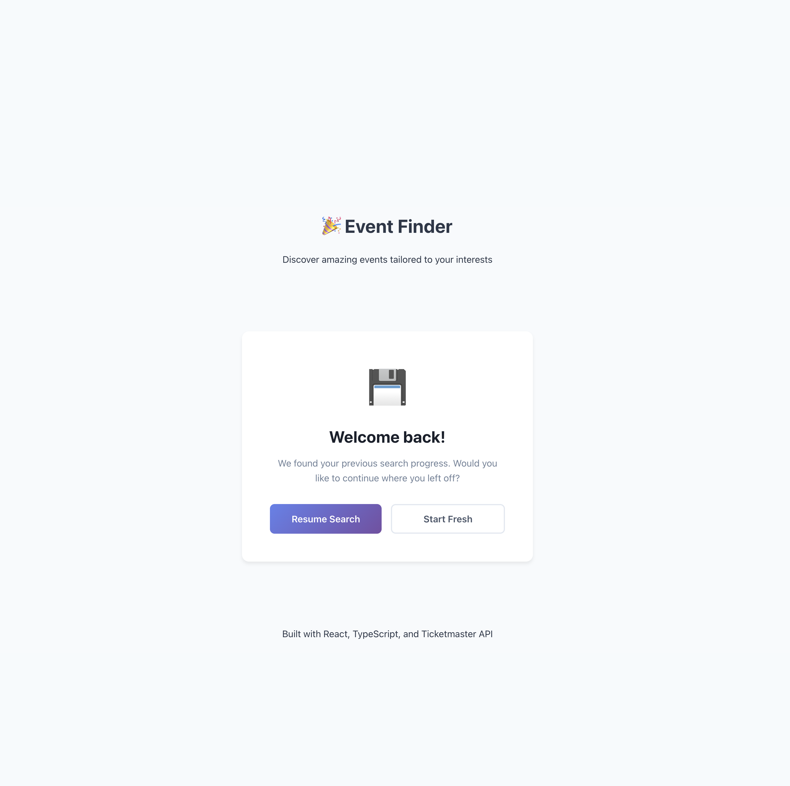

# Event Finder near you

Full-stack event discovery app using React, TypeScript, Express, and the Ticketmaster API.

## 📸 Screenshots

### Question Flow



_Multi-step question interface with city autocomplete and progress indicator_

### Search Results with Relevance Transparency



_Results table showing relevance factors, filtering, and sorting options_

### Resume Prompt



_Users can resume their previous search or start fresh_

## ✅ Requirements Implemented

1. **Configurable Question Flow** - `src/config/questions.ts`
2. **User Persistence** - localStorage with resume prompt
3. **Result Transparency** - Relevance factors shown on each result
4. **Result Filtering** - Filter by keyword, city, genre, price; sort by relevance/date/name
5. **Error Handling** - User-friendly messages throughout
6. **Reverse Proxy Backend** - Express protects API keys
7. **React + TypeScript** - Full type safety
8. **Unit Tests** - 62 tests with Vitest + React Testing Library

## 🏗️ Architecture

**Frontend**: React 19 + TypeScript + Vite  
**Backend**: Express + TypeScript  
**Testing**: Vitest + React Testing Library

```
src/
├── components/      # QuestionFlow, EventResults, ErrorBoundary, Loading
├── config/         # questions.ts (configurable questions)
├── services/       # api.ts (API layer)
├── utils/          # storage.ts (localStorage)
└── test/           # Unit tests

backend/src/
└── server.ts       # Express proxy + relevance scoring
```

## 🚀 Quick Start

**Prerequisites**: Node.js 18+, Ticketmaster API key

```bash
npm install
cp .env.example .env  # Add your TICKETMASTER_API_KEY
npm start             # Starts both frontend (5173) and backend (3001)
```

**Run tests**: `npm test`  
**With coverage**: `npm run test:coverage`

## 🎯 Key Design Decisions

See `ASSUMPTIONS.md` for detailed shortcuts and trade-offs.

**Technology Choices**:

- React 19 + TypeScript for type safety
- Vite for fast builds (vs Webpack)
- Express for simple API proxy
- Plain CSS (no framework) = 150KB bundle vs 500KB+ with Material-UI

**What I'd Add for Production**:

- Redis caching for API responses
- User authentication + database
- Rate limiting and monitoring
- E2E tests with Playwright
- CDN for static assets

## 📊 Test Coverage

62 tests passing | 66% overall coverage | 100% pure functions

**Test Strategy**: Focus on pure functions (storage, relevance scoring, config) + smoke tests for UI

See `TEST_SUMMARY.md` for details.

## 🚨 Known Limitations

This is a **prototype**, not production-ready:

- No authentication (open endpoints)
- No caching (hits Ticketmaster API every time)
- Basic styling (functional over beautiful)
- localStorage only (doesn't sync across devices)

See `ASSUMPTIONS.md` for complete list.

---

**Built by Karl Kwon**

Questions? Happy to discuss any design decisions!
